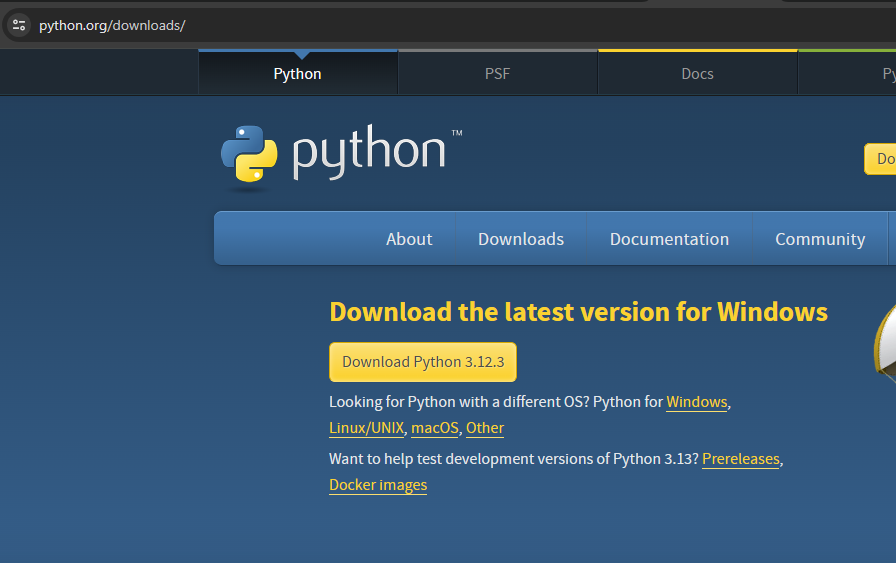
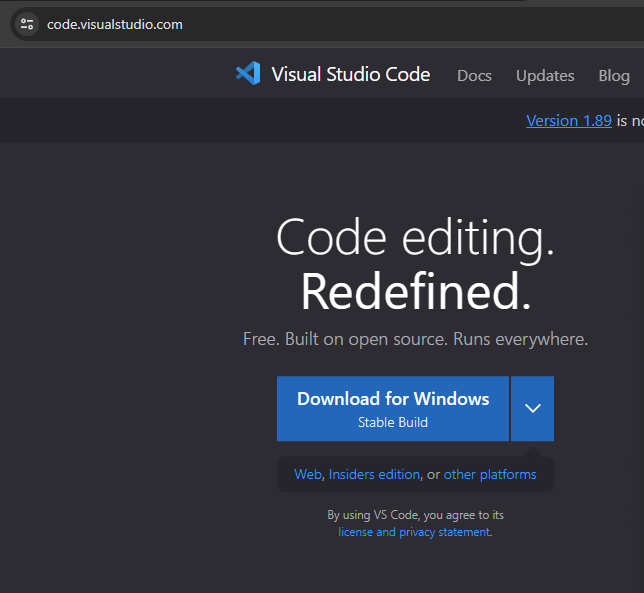

# Môi trường làm việc
Python 3.10 trở lên, tại tại [đây](https://www.python.org/downloads/).\

Visual Studio Code (VSCode), tải tại [đây](https://code.visualstudio.com/), hoặc Jupyter Lab (hướng dẫn cài ở phần sau).

# Cài đặt và sử dụng
## Với VSCode
1. Tải và cài đặt Python.
2. Tải và cài đặt VSCode.
3. Mở VSCode, vào phần Extension (Ctrl + Shift + X).

Để sử dụng, mở VSCode và tạo một file mới với đuôi là `.ipynb`.
## Với Jupyter Lab
1. Tải và cài đặt Python.
2. Mở Terminal (Windows 11), hoặc Command Prompt (tất cả Windows), từ đây gọi chung là Terminal.
3. Trong Terminal, chạy thử câu lệnh sau:
```
    pip -V
```
Nếu thực hiện thành công, có thể chuyển qua bước 4, nếu không, thực hiện lần lượt các câu sau
```
    curl https://bootstrap.pypa.io/get-pip.py -o "D:\get-pip.py"
    python "D:\get-pip.py"
```
4. Thực hiện lần lượt các câu lệnh sau.
```
    pip install -U jupyterlab
```
Để sử dụng Jupyter Lab, mở Terminal và thực hiện một trong hai câu lệnh sau:
1. `jupyter lab`
2. `python -m jupyter-lab`

Ngoài ra, để đơn giản, có thể tạo một icon ngoài desktop để mở Jupyter Lab như sau: